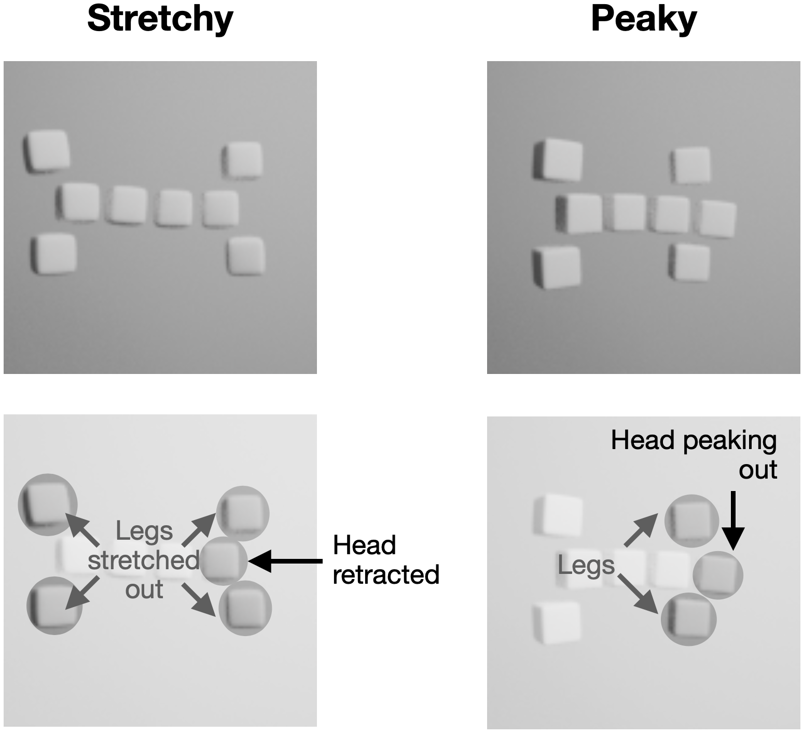
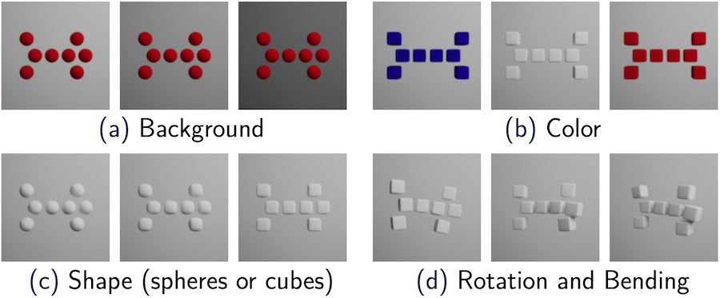

# Two4Two: Evaluating Interpretable Machine Learning -- A Synthetic Dataset For Controlled Experiments

## Introduction
Two4Two is a library to create sythetic image data crafted for human evaluations of interpretable ML apoaches (esp. image classification).
The sythetic images show two abstract animals: **Peaky** (arms inwards) and **Stretchy** (arms outwards). They are smilar looking, abstract animals, made of eight blocks.



These animals are simple enough to be used in instructions for human-subject evaluations on crowd-sourcing platforms. We also provide segmentation masks so they can be used for algorithmic evaluations as well. The core functionality of this library is that one can correlate different parameters with an animal type to create biase in the data. The changeable parameters are:
- Arm position – the main feature differentiating Peaky (inward) and Stretchy (outwards)
- Color of the animal and color of the background
- Shape of the blocks – continuously varying from
spherical to cubic
- Deformation/Bending of the animal
- Rotation (3 DoF) and Position (2 DoF) of the animal




This repositoy contains the source code which can be used to create custom biases as well as links to pregenerated datasets which may already be sufficent for some experiements.

We created this library because we see the choiche of dataset and user study scenario as a mayor obstacle to human subject evaluations.
If you find this dataset helful please cite our workshop paper (reference will be added after conference).

## Pregenerated datasets
Before you generate your own data consider using our pregenerated data of 80,000 images. You do not need to install this software to use this data.

[https://f001.backblazeb2.com/file/two4two/datasets_models/golden80k.tar.gz](https://f001.backblazeb2.com/file/two4two/datasets_models/golden80k.tar.gz)

We provide a [Colab Notebook](https://colab.research.google.com/drive/1-_sp1_eCc1ToeTQRxrXxGzaW-FLbGHxN?usp=sharing) that illustrates how you can use this dataset to train your own model.

If you would like to understand how this dataset was generated have a look at [the config that was used to generate it](config/color_spher_bias.toml)

## Installation
If you want to generate your own data follow these instructions.
Currently this project is not available through pip but has to installed manually.

Download this repository:

```git
git clone https://github.com/mschuessler/two4two.git

```

We suggest to create a python3 or conda environment instead of using your system python.

```
python3 -m venv ~/242_enviroment
source ~/242_enviroment/bin/activate
```

To install the **minimal installation** two4two package change into the cloned directory and run setuptools.

```
cd two4two
pip install .
```

To install the **installation including all requirements for generating your own training data** run:
```
pip install .[example_notebooks_data_generation]
```

To generate the default dataset on your own use the following comands
```
two4two_render_dataset config/color_spher_bias.toml
```

## Training Models on two4two
For training your own models you have two choices:
1) *No GPU required and installation free*: Run our example notebook inside of [Colab](https://colab.research.google.com/drive/1-_sp1_eCc1ToeTQRxrXxGzaW-FLbGHxN?usp=sharing) (this will download pregenerated datasets) - you can also run this notebook on your own machine you can find the notebook in [examples/GenerateData.ipynb](examples/GenerateData.ipynb)
2) Install the installation including all requirements for generating your own training data and training your own models**. This will install tensoflow and we recommend to have your own GPU available:
```
pip install .[example_notebooks_model_training]
wget https://f001.backblazeb2.com/file/two4two/datasets_models/golden80k.tar.gz
tar -xf golden80k.tar.gz
python two4two/examples/train_lenet.py spherical_color_bias
```

## Generate your own dataset
The jupyter-notebook **[examples/GenerateData.ipynb](examples/GenerateData.ipynb)** provides extensive details on how you can create your own *custom* data.
There are countless option to add biases to your custom dataset. The notebook is a great place to get started.


### Funding
Funded by the GermanFederal Ministry of Education and Research(BMBF) - NR 16DII113.
