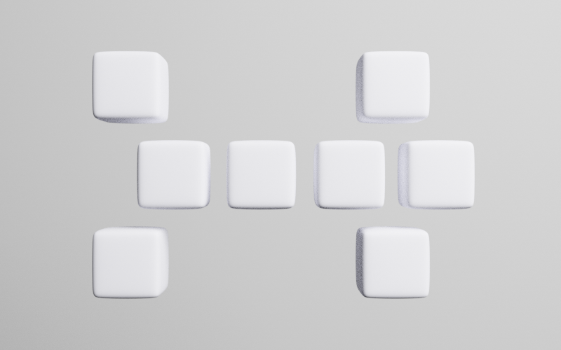
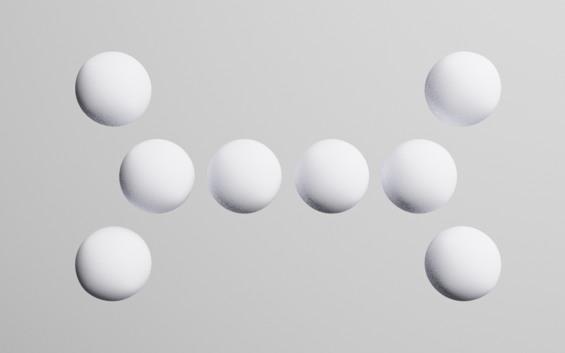
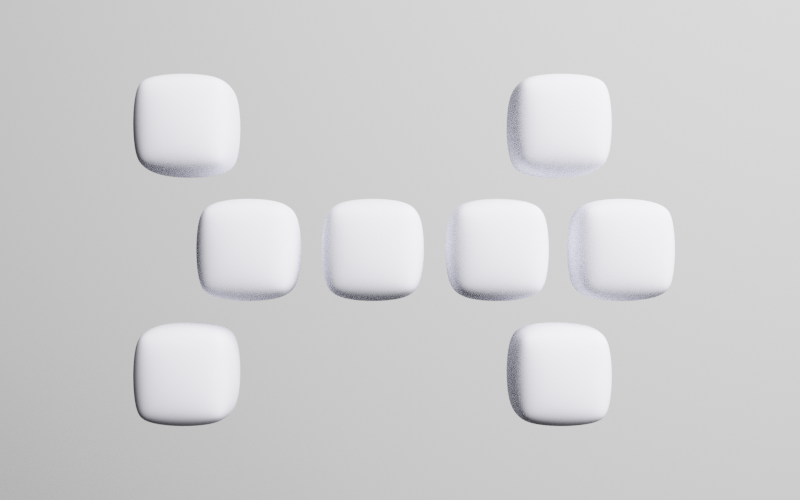
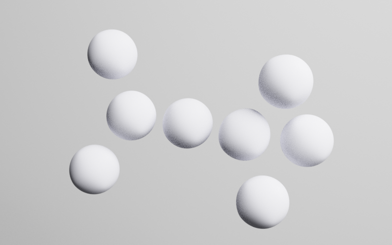
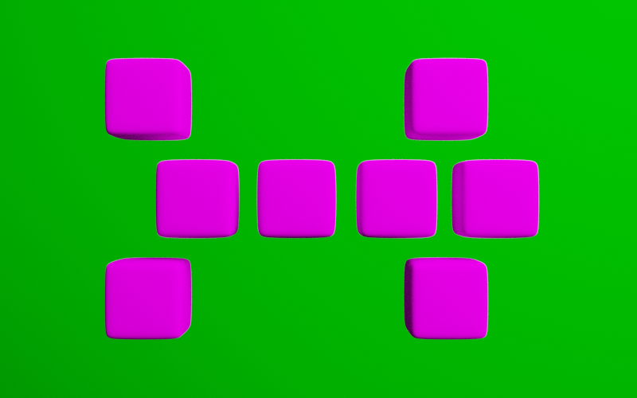
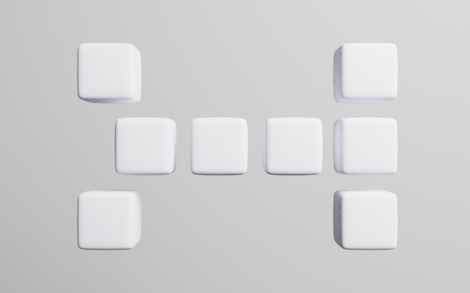
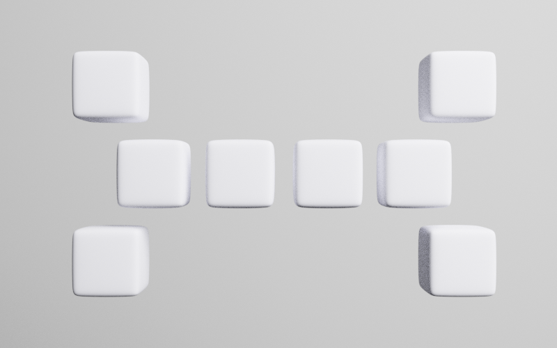

# two4two Image Dataset Generator

## Introduction
This program utilizes [blender](https://www.blender.org/) to generate image datasets.
Currently there are two classes.
They are smilar looking, abstract animals, made of eight blocks.
See [Section Classes](#classes) for details.
You can either install the module and create your own datasets or download an example dataset with 120,000 images.

## Installation
The programm can only run, if Blender 2.83 is installed in `two4two/blender`.
The programm was tested with version 2.83.9.
The Makefile should download blender, install pip for its bundled python and install the two4two module.
The download link within the Makefile is a mirror for Germany.
If any problems occur please see the script and reproduce the steps.
You need to put blender in the module folder and install pip for blender.
Then use pip to install numpy, scipy, matplotlib and a ipykernel.
After installing blender, use `setuptools` to install the `two4two` module for both the systems python as well as blender's python.
`python setup.py install && ./blender/2.83/python/bin/python3.7m setup.py install`

## Classes
The two classes for classifcation are *sticky* and *stretchy*.
Both objects are build from 8 blocks that can have different shapes.
Either cubes, spheres or something in between.
A sticky object made from cubes looks like this:

A stretchy object made from spheres looks like this:

The shapes can also morph from spherical to cube like.
Here is an example for something in between:

These objects can then assume a random pose.

You can change color of both object and background.

To blur the difference between the two classes the position of the class-defining set of arms can be randomly shifted.
By choosing a distribution for this the separation between the classes can be adjusted.
The following three pictures are a sticky object with arm shift 0.

Arm shift 0.5.
This is equal to a stretchy object with shift 0.5.

And finally shift 1.
This is equal to a stretchy object with shift 0.

Further parameters that can be adjusted: Object rotation (2 axis), a random flip and the position within the frame.
Documentation obviously needs to be improved further.

## Example Dataset
You can download an example dataset if you just want to assemble a dataset.
There are six different sets with 20,000 images each.
For the two classes there is a set with cubes, spheres and random shapes respectively.

## Acknoledgement
Thanks to [Martin Schuessler](http://mschuessler.de/) for guidance and support.
I was working as a student assistent with him and developed this tool for his research.
Also thanks to [Leon Sixt](https://userpage.fu-berlin.de/leonsixt/) for help with some parts of the code and especially for the arm-shift idea.
And finally thanks to the rest of [Research Group 20](https://www.weizenbaum-institut.de/index.php?id=95&L=5) of the Weizenbaum Insitute for giving me the opportunity use my time to develop this and make it public.
### Funding
Funded by the GermanFederal Ministry of Education and Research(BMBF) - NR 16DII113.